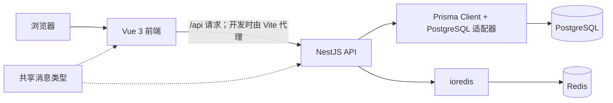

# OneDep

`apps/web` 是 Vue 3 + Vite 前端，`apps/api` 是 NestJS API；本地 PostgreSQL 和 Redis 由 Docker Compose 提供。`packages/shared` 提供前后端共用的消息类型。

## 技术架构

项目使用 pnpm workspace 管理两个应用和一个共享包。前后端分别运行；Docker Compose 在本地提供数据服务。



版本以 `.nvmrc`、`package.json`、`pnpm-lock.yaml` 和 Docker Compose 镜像标签为准。

| 部分 | 技术 | 版本 |
| --- | --- | --- |
| 运行环境 | Node.js / pnpm | 22.23.3 / 12.9.1 |
| 前端 | Vue / Vue Router / Pinia | 3.5.43 / 5.3.1 / 4.0.3 |
| 前端构建 | Vite | 8.3.3 |
| API | NestJS (`@nestjs/core`) | 12.1.2 |
| 数据访问 | Prisma Client / PostgreSQL 适配器 | 7.10.0 / 7.10.0 |
| Redis 客户端 | ioredis | 6.0.0 |
| 语言 | TypeScript | 6.0.3 |
| 测试 | Vitest | 4.1.11 |
| 本地数据库 | PostgreSQL 镜像 | `18-alpine` |
| 本地 Redis | Redis 镜像 | `8-alpine` |

## 本地启动

需要 nvm、Docker 和 Docker Compose。项目使用 Node 22.23.3、pnpm 12.9.1。

```bash
nvm use
corepack enable
pnpm install
cp apps/api/.env.example apps/api/.env
pnpm docker:up
pnpm --filter api exec prisma migrate deploy
```

`pnpm install` 会生成 Prisma Client。之后分别在两个终端运行：

```bash
pnpm dev:api
pnpm dev:web
```

前端地址以 Vite 输出为准，默认是 http://localhost:5173；API 默认是 http://localhost:3000/api，健康检查是 http://localhost:3000/api/health。前端开发服务器会将 `/api` 请求代理到 API。

## 联通演示

打开前端首页，输入一条留言并保存。`POST /api/messages` 将留言写入 PostgreSQL，同时清除 Redis 中的列表缓存。页面随后调用 `GET /api/messages` 读取最近 10 条留言：首次从 PostgreSQL 读取并缓存 60 秒，再点“刷新列表”会从 Redis 读取。页面会显示本次读取的数据来源。

## 检查

```bash
pnpm build
pnpm lint
pnpm test
pnpm --filter api test:e2e
```

端到端测试需要先启动 PostgreSQL 和 Redis，并应用数据库迁移。
`pnpm test:cov` 目前只统计 API 覆盖率。

## 目录与配置

- `apps/api/prisma/schema.prisma`：数据库模型；迁移提交在 `apps/api/prisma/migrations`。
- `apps/api/.env.example`：本地环境变量示例；复制后的 `.env` 不提交到 Git。
- `apps/web/src/views` 和 `apps/web/src/router`：页面与路由。
- `packages/shared`：前后端共用的留言接口类型。

Docker Compose 中的数据库口令仅供本地开发。

## 生产部署

推送到 `main` 后，GitHub Actions 会为 `linux/amd64` 构建 API 和 Web 镜像，并发布到 GitHub Container Registry。生产 Compose 使用 `ghcr.io/bearxjj/onedep-api:main` 和 `ghcr.io/bearxjj/onedep-web:main`；数据库迁移复用 API 镜像，服务器不参与构建。

首次发布后，确认两个容器包允许服务器拉取：公开包可以直接拉取，私有包需要先在服务器登录 GHCR。生产数据库密码保存在服务器的 `.env.production`，不要提交到 Git。

在服务器更新代码中的 Compose 文件后，拉取并启动服务：

```bash
cd /opt/onedep
docker compose --env-file .env.production -f compose.production.yml pull
docker compose --env-file .env.production -f compose.production.yml up -d
docker compose --env-file .env.production -f compose.production.yml ps
```

PostgreSQL 和 Redis 的数据分别保存在 Compose 卷中。Web 只监听服务器本机的 `127.0.0.1:8080`，由 1Panel 网站反向代理并配置 HTTPS。
